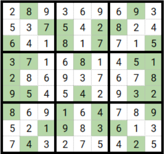
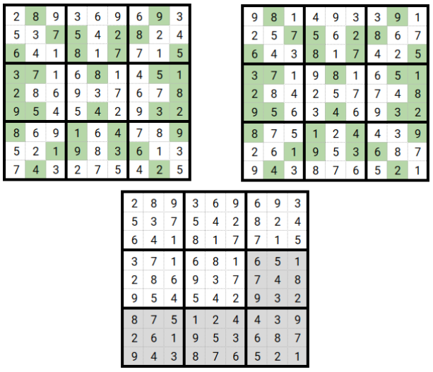
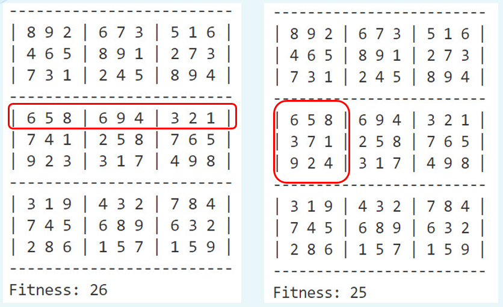

# Giải bài toán sudoku bằng thuật toán di truyền

## Thuật toán di truyền là gì?
Một thuật toán di truyền (Genetic Algorithm) là một phương pháp hueristic lấy cảm hứng từ quá trình chọn lọc tự nhiên, thuộc về các thuật toán tiến hóa. Thuật toán di truyền thường được sử dụng để tạo ra các giải pháp chất lượng cao cho các vấn đề tối ưu hóa và tìm kiếm bằng cách dựa vào các toán tử lấy cảm hứng từ sinh học như đột biến, giao phối và chọn lọc.

## Cách hoạt động của Genetic Algorithm (GA)
1. Tạo quần thể ban đầu với mỗi cá thể là lời giải của bài toán, đánh giá mỗi cá thể dựa vào phương pháp đánh giá.
2. Chọn các cá thể tốt nhất làm "parents" của thế hệ mới "children". Để tránh eugenic, một phần nhất định của quần thể (bao gồm cả các cá thể kém) được chọn làm cha mẹ.
3. Thế hệ "con" được sinh ra, kế thừa các phần tử của "cha" và "mẹ".
4. Cuối cùng đột biến một phần nhất định của quần thể mới tạo ra.
5. Lặp lại bước 2, 3, 4 cho đến khi tìm ra được cá thể đáp ứng yêu cầu bài toán.

## Xây dựng cấu trúc chương trình
```c++
struct Coord { // Cấu trúc tọa độ (x, y) của ô
    int x, y;
}

struct  Cell { // Cấu trúc của ô
    Coord position;
    int valueAt;
    bool fixed;
}

struct Block { // Cấu trúc của khối
    Cell cells[NUM_CELLS_INSIDE_BLOCK];
}

struct  Sudoku { // Cấu trúc của Sudoku
    int board[ROWS][COLS];
    int scoreFit;
    Block blocks[NUM_BLOCKS];
}
```

## Khởi tạo quần thể
Ở đây, chúng ta chỉ ngẫu nhiên tạo ra một số **"lời giải"** (solution) để đánh giá. Nếu chúng ta muốn thuật toán của mình tối ưu hơn, chúng ta cần hỗ trợ nó một chút để việc tạo ra một cá thể không hoàn toàn ngẫu nhiên. Cách tiếp cận là tạo ra một **"lời giải"** tiềm năng mà không có sự trùng lặp trong các **khối**. Nhưng tất nhiên, có thể (và chắc chắn có) sự trùng lặp trong các hàng và cột.



Các ô có màu xanh là những ô cố định (fixed) mà đề bài đã cho, không thể được thay thế trong quá trình điền ngẫu nhiên. Có thể thấy không có sự trùng lặp ở mỗi khối, nhưng có sự trùng lặp ở hàng và cột.

## Đánh giá thích nghi
Đây là điều quan trọng nhất cần nghĩ đến khi xử lý GA vì điều này sẽ xác định cách chúng ta sẽ đánh giá các **giải pháp** (solution).

Trong trường hợp sudoku, hàm fitness đếm số lần trùng lặp trong giải pháp tiềm năng: có bao nhiêu giá trị bị trùng lặp có thể được tìm thấy trong tổng số hàng và cột? (không có sự trùng lặp giá trị trong khối vì thuật toán xử lý điền giá trị ngẫu nhiên vào ô trống, đã được thiết lập luật không có sự trùng lặp trong khối).

Vì vậy mục tiêu của chúng ta là giảm thiểu điểm số Fitness này (cá thể có điểm Fitness nhỏ là cá thể trội, ngược lại là cá thể yếu). Cá thể có điểm Fitness = 0 là **đáp án** của bài toán. 

## Tạo cá thể con
Hai giải pháp tiềm năng được chọn ngẫu nhiên và tạo ra n đứa con (n là số lượng con được tạo ra từ việc lai ghép giữa hai cá thể cha mẹ, người lập trình thiết lập hằng số n).

Những gì chúng ta cần làm là lấy một số yếu tố từ cha và một số khác từ mẹ. Nhưng làm thế nào?

Để làm điều đó, chúng ta ngẫu nhiên chọn điểm gọi là **crossover point**: quyết định của tôi là lấy các khối của cha (từ khối ở vị trí thứ nhất đến crossover point) và y khối của mẹ (từ crossover point đến khối cuối cùng) kết hợp lại với nhau sẽ tạo ra được cá thể mới, kế thừa các phần tử của cá thể cha mẹ.


## Đột biến
Mỗi cá thể con được sinh ra sẽ được kế thừa lại những đặc tính của cả cha và mẹ. Sau một thời gian sinh sống, một quần thể sẽ đặt tới giới hạn của các cặp gen của con được tạo nên từ gen của bố mẹ. Để đạt được tới sự **tiến hóa**, đột biến chính là một trong những nguyên nhân chính, có vai trò đóng góp nguyên liệu cho quá trình **Chọn lọc tự nhiên**.

Quyết định của tôi để xử lý quá trình đột biến là sẽ dò tìm các hàng của cá thể mà có sự trùng lặp giá trị. Sau đó chọn ngẫu nhiên một khối thuộc hàng đó, sắp xếp điền ngẫu nhiên lại các giá trị ô trống (những ô không phải ô cố định - không được đề bài cho).


